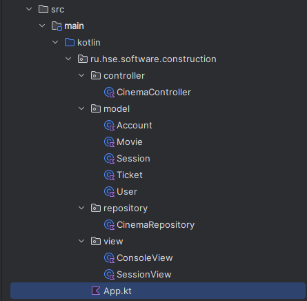

# Домашнее задание №1
## Евсюков Александр   Группа БПИ224

### Диаграмма классов:
https://drive.google.com/file/d/1T2UlMImMMwASl_3IPerpUppsJUAAteJ7/view?usp=sharing

### Диаграмма прецедентов: 
https://drive.google.com/file/d/1iAw-lHYN5CcflZaO35EcTgpBBV_CWve4/view?usp=sharing

### Набор требований к проекту:
* `Java` версии 21
* `Kotlin` версии 1.9.0
* `Gradle` версии 8.2

### Инструкция по запуску:
1. Склонируйте репозиторий с помощью команды `git clone
2. Откройте проект в `IntelliJ IDEA`
3. Запустите проект с помощью комбинации клавиш `Ctrl + F10` или нажав на кнопку `Run` в правом верхнем углу 
(пытался запустить через терминал, но там что-то непонятное происходит)

### Структура проекта:

Проект построен согласно MVC паттерну:
- Файл `App` - точка входа в приложение
- В пакете `model` находятся модели данных
    * `User` - модель пользователя
    * `Account` - модель аккаунта, которая создает `MutableList<User>` и обрабатывает запросы к нему (добавление, удаление пользователей и т.д.)
    * `Movie` - модель фильма
    * `Ticket` - модель билета
    * `Session` - модель сеанса, которая создает  `MutableList<Movie>` и 
  обрабатывает запросы к нему (добавление, удаление фильмов, управление занятыми местами и т.д.)
- В пакете `views` находятся представления
    * `ConsoleView` - хранит методы создания и отображения консольного меню
    * `SessionView` - хранит методы создания и отображения информации о фильме (общая инфомация о фильме и визуализация занятых мест)
- В пакете `controllers` находится контроллер
    * `Controller` - основной управляющий класс, который обрабатывает запросы пользователя и вызывает соответствующие методы моделей и представлений
- В пакете `Repository` находится репозиторий
    * `CinemaRepository` - класс, который сериализует и десериализует данные о фильмах и пользователях в файлы `session.json` и `users.json`

### Сериализация и десериализация данных:
Для сериализации и десериализации данных используется `Jackson`. Данные хранятся в файлах `session.json` и `users.json` в корне проекта.
Такой тип сериализации был выбран, потому что он позволяет хранить данные в удобном формате и не требует дополнительных настроек.

### Шифрование паролей:
Для шифрования паролей используется `MessageDigest` с алгоритмом `SHA-256`. Такой алгоритм был выбран, потому что он позволяет хранить пароли в безопасном виде и не требует дополнительных настроек.

### Скриншоты работы программы:

 

и т.д.

`P.S.` Все скриншоты находятся в папке `screenshots`. При реализации возникли проблемы с датами (установка и ввод с клавиатуры) и в силу ограниченности времени не успел поправить. Также в некоторых местах возможно не хватает проверок и траев)

